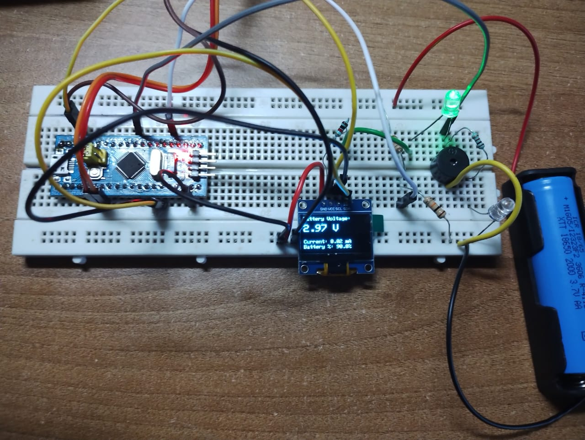

# Battery Management System using STM32

This repository contains the implementation of a Battery Management System (BMS) using the STM32F103C8T6 (Blue Pill) microcontroller. The system monitors battery voltage and current, calculates State of Charge (SOC), and displays real-time values on an OLED display. Audible and visual alerts are triggered during low SOC or abnormal current conditions.

Developed as part of the Experiential Learning Program under the Department of Electronics and Communication Engineering.

## Objective

To develop a low-cost and efficient BMS using ARM-based embedded systems capable of:
- Monitoring voltage and current in real-time
- Estimating and displaying battery SOC
- Alerting users during critical battery conditions

## Features

- Real-time ADC-based voltage and current monitoring
- SOC estimation
- OLED display via I2C (SSD1306, 0.96")
- Buzzer alert when SOC < 20% or current spike occurs
- LED indicators for battery status
- Based on STM32F103C8T6 (ARM Cortex-M3)

## Components Used

| Component              | Description                          |
|------------------------|--------------------------------------|
| STM32F103C8T6          | Blue Pill board (ARM Cortex-M3)      |
| OLED Display (0.96")   | SSD1306, I2C interface               |
| Buzzer                 | Audible alert                        |
| Shunt Resistor         | Current sensing                      |
| Voltage Divider        | For voltage measurement              |
| Green & Red LEDs       | Battery status indication            |
| Resistors              | 220Ω–10kΩ                            |
| Breadboard + Wires     | Prototyping setup                    |

## Circuit Connections

| Module         | STM32 Pin | Purpose                   |
|----------------|-----------|---------------------------|
| Voltage Divider| PA0       | Battery voltage input      |
| Shunt Resistor | PA1       | Current sensing input      |
| OLED SDA       | PB7       | I2C Data Line              |
| OLED SCL       | PB6       | I2C Clock Line             |
| Buzzer         | PC13      | Alert output               |
| Green LED      | PB0       | Indicates normal status    |
| Red LED        | PB1       | Indicates critical status  |

## Circuit Diagram

Below is the schematic of the system:

<p align="center">
  
</p>

## Group Photo and Hardware Output

### Group Photo

<p align="center">
  
</p>

### OLED Output - Battery > 20%

<p align="center">
  
</p>

- Green LED ON  
- Buzzer OFF  
- OLED displays Voltage, Current, and SOC  

### OLED Output - Battery < 20%

<p align="center">
  
</p>

- Red LED ON  
- Buzzer ON  
- OLED shows SOC warning  

## Code Snippet

```cpp
float voltage = analogRead(PA0) * (actual_voltage_ratio);
float shunt_voltage = analogRead(PA1) * voltage_per_bit;
float current = shunt_voltage / shunt_resistor_value;

int soc = map(voltage, min_voltage, max_voltage, 0, 100);

if (soc < 20 || current > max_safe_current) {
    digitalWrite(buzzer_pin, HIGH);
    digitalWrite(red_led_pin, HIGH);
} else {
    digitalWrite(buzzer_pin, LOW);
    digitalWrite(green_led_pin, HIGH);
}

```
```
OLED Display Format
(a) When SOC is above threshold:

Battery Voltage: 3.74V
Current: 0.28A
SOC: 72%

```
```
(b) When SOC is below threshold:

Warning: Low SOC!
Voltage: 2.84V
SOC: 17%

```

## Technical References

- [STM32F103C8T6 Datasheet](https://www.st.com/resource/en/datasheet/stm32f103c8.pdf)
- [SSD1306 OLED Datasheet](https://learn.adafruit.com/monochrome-oled-breakouts)
- [Battery Management Overview (TI)](https://www.ti.com/power-management/battery-management/overview.html)
  
---

## Contributors

- Ballambettu Milan Shankar Bhat (4NI23EC019)
- Pranav Maruti Shanbhag (4NI24EC407)
- Anirudha Jayaprakash (4NI23EC014)
- Adithya Y (4NI23EC005)


